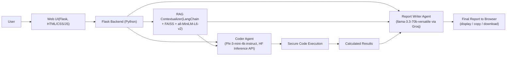

# AI Lab Report Agent — Architecture

> A web-based agent that turns a lab manual + experimental observations into a complete, formal lab report.

## Overview
The AI Lab Report Agent automates the generation of engineering and science lab reports. It ingests a lab manual (PDF/DOCX) and a set of experimental observations (e.g., JSON) and outputs a structured, human-readable report—dramatically reducing documentation time and effort.

## High-Level Architecture

## System Architecture & Interaction Flow
1. **User Input** — The user uploads a lab manual (PDF/DOCX) and provides experimental observations (JSON) via a web UI.  
2. **Contextualization (RAG)** — Raw text is extracted from the manual; a Retrieval-Augmented Generation component retrieves the most relevant context (Aim, Theory, Procedure).  
3. **Code Generation** — A specialized **Coder Agent** produces a Python script tailored to the experiment’s calculations.  
4. **Code Execution** — The script executes in a secure sandbox; its outputs (calculated results) are captured.  
5. **Report Synthesis** — A **Report Writer Agent** fuses the RAG context, observations, and computed results into a cohesive, formal lab report.  
6. **Output** — The final report is returned to the browser for viewing, copying, or downloading.  

## Core Components

### 1) Frontend (Web UI)
- **Tech:** Flask, HTML, CSS, JavaScript  
- **Purpose:** Simple interface for file uploads, observation input, and viewing/downloading the generated report.  

### 2) Backend (Flask Application)
- **Tech:** Python, Flask  
- **Role:** Central orchestrator; handles HTTP requests and coordinates the multi-step pipeline.  

### 3) RAG Component (Contextualizer)
- **Purpose:** Efficiently extracts theoretical/procedural context from lengthy lab manuals.  
- **Libraries/Models:** LangChain, FAISS (vector store), `all-MiniLM-L6-v2` (embeddings).  
- **Why this approach:**  
  - RAG focuses the LLM on the most relevant paragraphs—lower latency and cost than sending entire manuals.  
  - FAISS is fast and memory-efficient for vector search.  
  - `all-MiniLM-L6-v2` balances quality and footprint for embeddings.  

### 4) Coder Agent
- **Purpose:** Generate executable Python for experiment-specific calculations.  
- **Model:** Fine-tuned `microsoft/Phi-3-mini-4k-instruct` (hosted as **Barghav777/phi3-lab-report-coder**).  
- **Deployment:** Hugging Face Inference API (avoids local GPU/driver hassles and enables reliable latency).  
- **Why this model:** Strong coding ability in a compact form; fine-tuning specializes it for lab-calc patterns.  
- **Link:** https://huggingface.co/Barghav777/phi3-lab-report-coder  
- **Dataset:** Hosted in the project’s GitHub repository.  

### 5) Report Writer Agent
- **Purpose:** Synthesize RAG context + observations + computed results into a polished, formal lab report.  
- **Model:** **llama-3.3-70b-versatile** via the **Groq API**.  
- **Why this setup:** 70B offers strong coherence and style; Groq delivers very low latency for an interactive UX.  
